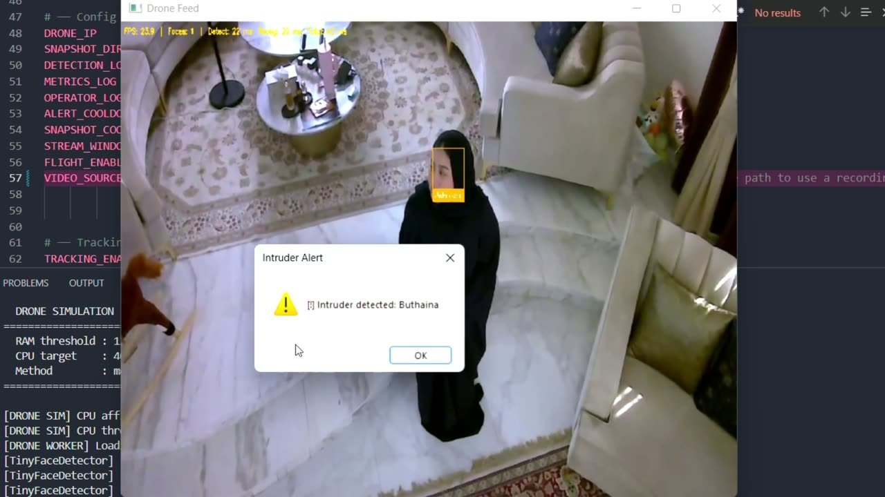

<div align="center">

# Design and Evaluation of a Low-Latency Drone-Based Vision System

**Alyaa Alghfeli · Buthaina Almulla · Dilnaz Utemissova · Jenna Khanfar · Shamma Yaqoob**

Mohamed bin Zayed University of Artificial Intelligence (MBZUAI), Abu Dhabi, UAE

[**🌐 Project Page**](https://bubulean.github.io/low-latency-drone-vision/) &nbsp;|&nbsp;
[**📄 Paper (PDF)**](assets/paper.pdf) &nbsp;|&nbsp;
[**🚁 Live Drone App**](https://github.com/bubulean/drone_project) &nbsp;|&nbsp;
[**📊 Benchmark Harness**](https://github.com/jennakhanfar/IOT-DRONE-PROJECT) &nbsp;|&nbsp;
[**🎬 Demo Video**](assets/demo.mp4)

<a href="https://bubulean.github.io/low-latency-drone-vision/"></a>

</div>

## TL;DR

We benchmark **seven face recognizers** (1.1 M → 65 M params) under a simulated **400 MHz single-core / 128 MB** UAV compute budget, with the detector and everything else held fixed, then replay the winners through a **live drone streaming pipeline**.

**MobileFaceNet** hits **92.74%** on DroneFace at **16.7 ms (59.7 FPS)**. That is within ~3 points of the accuracy-best ArcFace-R50 while running **~39× faster**.

## Overview

The study has three phases:

| Phase | What | Code |
|---|---|---|
| **1. Live pipeline** | Hula drone → RTP stream → laptop GUI. UltraFace detection + embedding recognition run in an isolated “drone-side” subprocess with a depth-1, drop-old frame queue. Alerts, snapshots, and optional tracking. | [`bubulean/drone_project`](https://github.com/bubulean/drone_project) |
| **2. Benchmark harness** | Detector, preprocessing, gallery, and cosine metric fixed; only the recognizer varies. Single-core affinity, duty-cycle CPU throttling (250/400/650 MHz), and a hard 128 MB RSS-delta kill. | [`jennakhanfar/IOT-DRONE-PROJECT`](https://github.com/jennakhanfar/IOT-DRONE-PROJECT) |
| **3. Live re-validation** | Top-2 models replayed through the live pipeline on 17 edge-case clips (hijab, glasses, mask, steep angles, near-dark, harsh sun). | [`bubulean/drone_project`](https://github.com/bubulean/drone_project) |

## Key results

DroneFace, 400 MHz / 128 MB inference budget:

| Model | Params | Acc. (%) | Latency (ms) | FPS | Size (MB) | ΔRAM (MB) |
|---|---:|---:|---:|---:|---:|---:|
| ArcFace-R50 | 43.6 M | **95.75** | 659.2 | 1.5 | 166.3 | 14.2 |
| ArcFace-R100 | 65.0 M | 93.18 | 1152.5 | 0.9 | 248.6 | 12.5 |
| **MobileFaceNet** | 1.2 M | 92.74 | **16.7** | **59.7** | **13.0** | **0.2** |
| ArcFace-R18 | 12.4 M | 86.80 | 55.2 | 18.1 | 91.8 | 9.2 |
| FaceNet | 27.9 M | 78.37 | 261.4 | 3.8 | 106.8 | 12.6 |
| FaceNet-CASIA | 28.9 M | 74.85 | 241.1 | 4.1 | 110.6 | 13.8 |
| SFace | 1.1 M | 56.96 | 109.1 | 9.2 | 36.9 | 0.2 |

**Findings**

1. **MobileFaceNet is the practical winner.** It gets near-top accuracy at real-time speed and is the only top model that fits the RAM budget.
2. **Training distribution matters as much as capacity.** FaceNet scores 93.33% on VGGFace2 (its training set) but 78.37% on DroneFace. ArcFace models show the reverse.
3. **CPU frequency is not a universal lever.** Only mid-weight models scale. Tiny models are overhead-bound and heavy ones are compute-saturated.
4. **Live streaming exposes a threshold problem.** The ranking holds live, but absolute accuracy drops (MobileFaceNet goes from 92.74% to 23.5%). This is driven mostly by similarity-below-τ “Unknown” misses rather than identity confusion.

See the [project page](https://bubulean.github.io/low-latency-drone-vision/) for interactive charts, per-altitude/per-distance breakdowns, and the live re-validation results.

## Repository contents

```
.
├── index.html          # project page (served by GitHub Pages)
├── assets/
│   ├── paper.pdf       # full paper
│   ├── demo.mp4        # live demo video (720p)
│   └── poster.jpg
└── README.md
```

The page is a single static HTML file with no build step. To preview it locally, run `python3 -m http.server` and open <http://localhost:8000>.

## Citation

```bibtex
@techreport{alghfeli2026dronevision,
  title       = {Design and Evaluation of a Low-Latency Drone-Based Vision System},
  author      = {Alghfeli, Alyaa and Almulla, Buthaina and Utemissova, Dilnaz
                 and Khanfar, Jenna and Yaqoob, Shamma},
  institution = {Mohamed bin Zayed University of Artificial Intelligence},
  address     = {Abu Dhabi, United Arab Emirates},
  year        = {2026}
}
```
